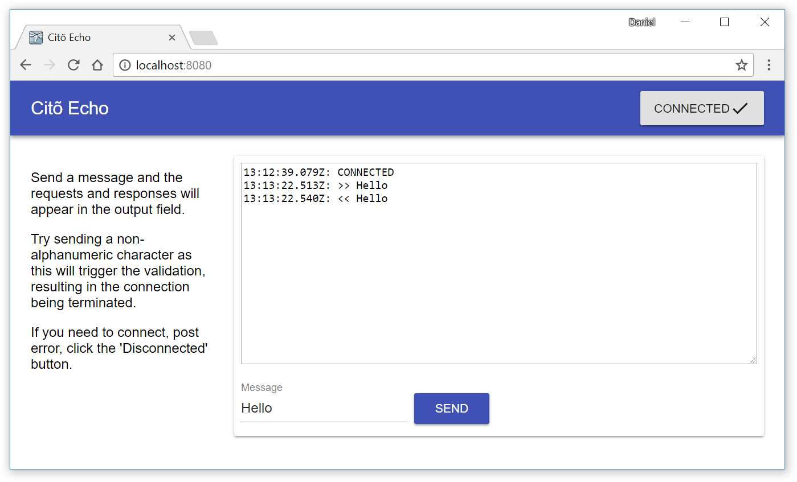

 

# Citō Echo Example

:information_source: **Note:** Citō has not yet been released yet, therefore this must be build locally prior to running this.

Very simple webapp that uses [Citō](http://cito.io) and to echo responses back to the user. Simply run using

	mvn wildfly-swarm:run

...and navigate to <http://localhost:8080>.

That's it!

## FAQ ##

### Why use the in-VM `ConnectionFactory`? ###

This demo utilises Wildfly Swarm which through fractions actually behaves as a JEE container and unfortunately the specification prohibits the direct use of `MessageListener` inside of a container. To ensure there are no unnecessary open ports and loop-back connections we access the in-VM `ConnectionFactory` directly which circumvents this restriction.